# E-Commerce Sales Analytics Dashboard

## Project Overview

This project analyzes e-commerce sales data using MySQL and Tableau to identify sales trends, top-performing products, profitability, and regional performance.

The goal of this project is to transform raw sales data into meaningful business insights through SQL analysis and interactive data visualization.

---

## Tools & Technologies

- MySQL Workbench
- Tableau Public
- Microsoft Excel
- SQL

---

## Project Workflow

### 1. Data Preparation
- Cleaned and formatted the sales dataset in Excel.
- Verified data quality and consistency.

### 2. SQL Analysis
Imported the dataset into MySQL and performed business analysis using SQL queries.

Key analyses include:

- Total Sales
- Total Profit
- Total Orders
- Average Discount
- Top 10 Products by Sales
- Monthly Sales Trend
- Category-wise Sales Analysis
- Region-wise Profit Analysis

### 3. Data Visualization
Connected the dataset to Tableau and created an interactive dashboard featuring:

- KPI Cards
  - Total Sales
  - Total Profit
  - Total Orders
  - Average Discount

- Visualizations
  - Monthly Sales Trend
  - Top 10 Products by Sales
  - Category Sales Analysis
  - Region Profit Analysis

- Interactive Filters
  - Order Date
  - Region
  - Sub-Category

### 4. Business Insights
Generated insights to support data-driven decision making.

---

## Key Insights

- North region generated the highest profit.
- Accessories category recorded the highest sales.
- Average discount across orders was approximately 10%.
- Sales peaked during mid-2025.
- Headphones were the highest-selling products.
- Mobile and Women's Wear generated comparatively lower sales.

---

## SQL Queries Included

The repository contains a separate SQL file with all analysis queries, including:

- Total Sales Query
- Total Profit Query
- Total Orders Query
- Average Discount Query
- Top Products Query
- Monthly Sales Trend Query
- Region Profit Query
- Category Sales Query

---

## Dashboard Preview

### Main Dashboard

Dashboard screenshot:

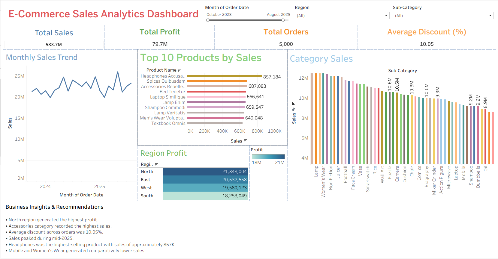

---

### Individual Visualizations

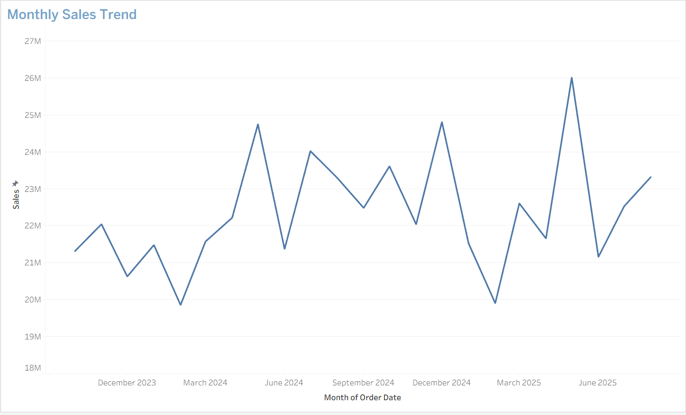

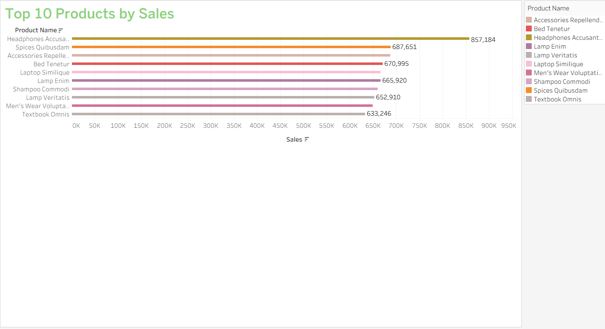

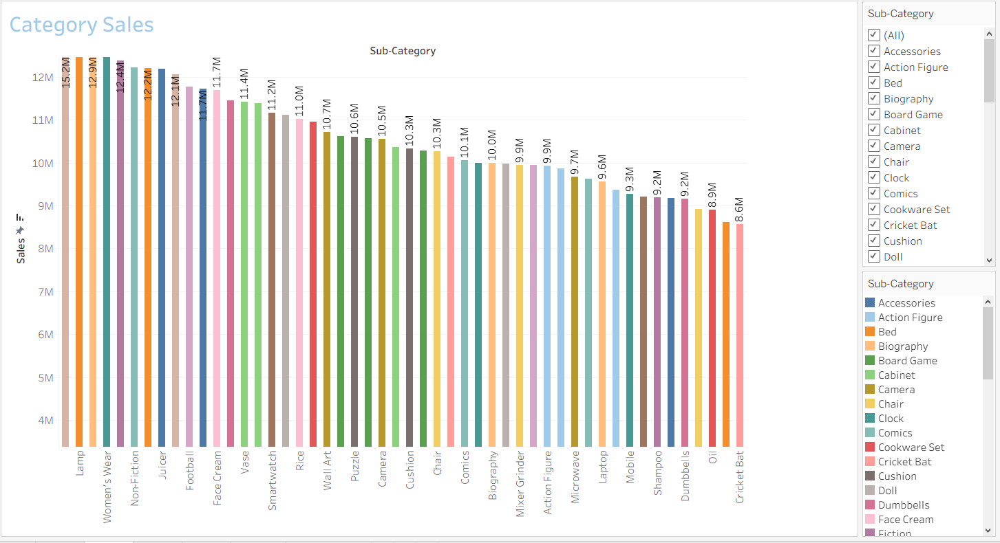

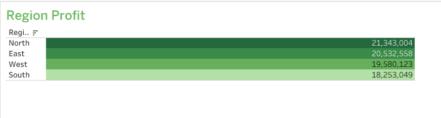

---

## Query Preview

### Category Wise Sales
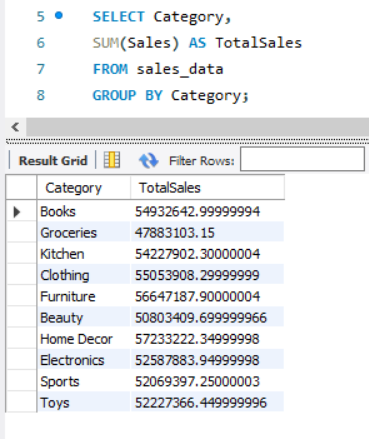

### Total Sales
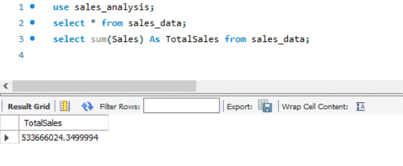

### Total Profit
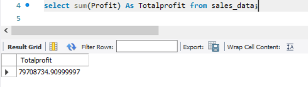

### Monthly Sales Trend
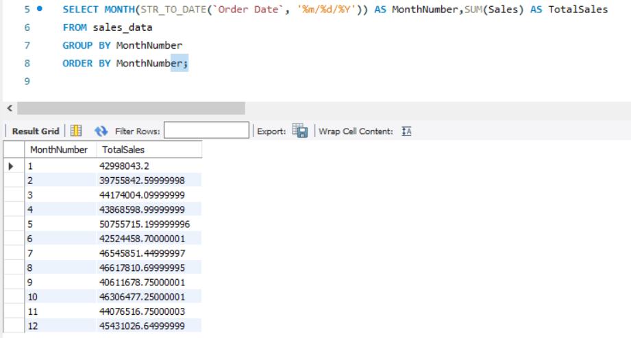

### Region Wise Profit
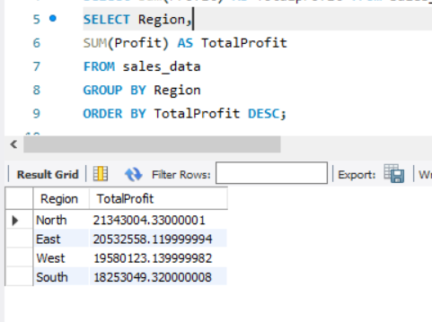

### Top Selling Products
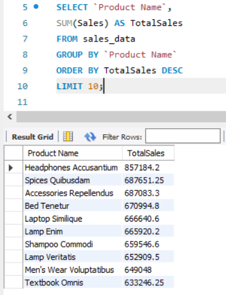

---

## Project Structure

```text
E-Commerce-Sales-Analytics/
│
├── Dataset/
│   └── sales_analysis.csv
│
├── SQL/
│   └── sales_analysis_queries.sql
│
├── Dashboard/
│   ├── dashboard.png
│   └── tableau_dashboard.twb
│
├── Screenshots/
│   └── query_results.png
│
└── README.md
```

---

## Project Highlights

✔ Cleaned and analyzed sales data using MySQL

✔ Created interactive Tableau dashboard

✔ Built KPI cards for Sales, Profit, Orders, and Discounts

✔ Performed Top Product, Category, and Regional Analysis

✔ Added interactive filters for dynamic exploration

---

## Future Improvements

- Customer Segmentation Analysis
- Sales Forecasting
- Product Recommendation Insights
- Advanced Tableau Storyboards
- Predictive Analytics using Python

---

## Author

Anjali Sharma

Aspiring Data Analyst skilled in SQL, Tableau, Excel, and Data Visualization.